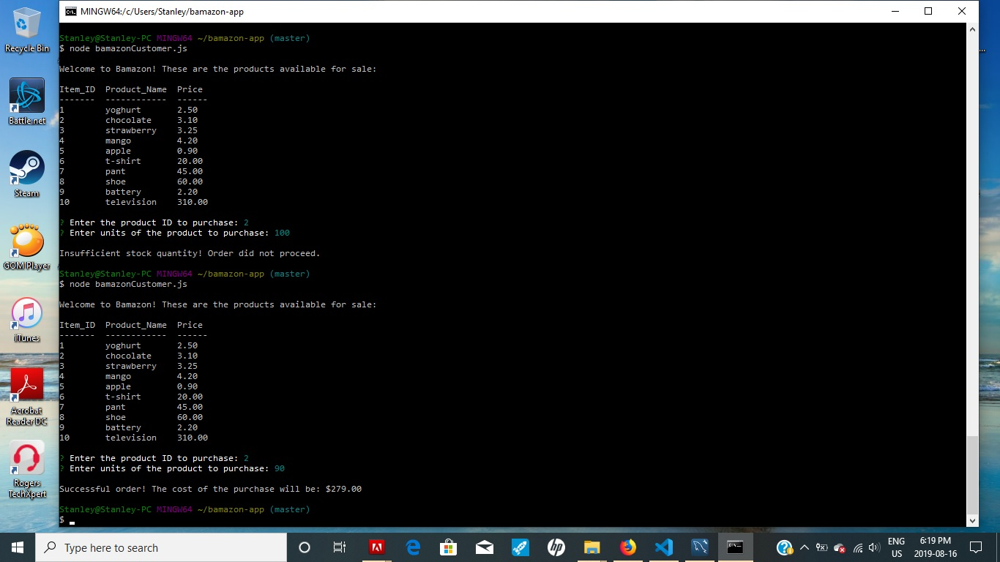
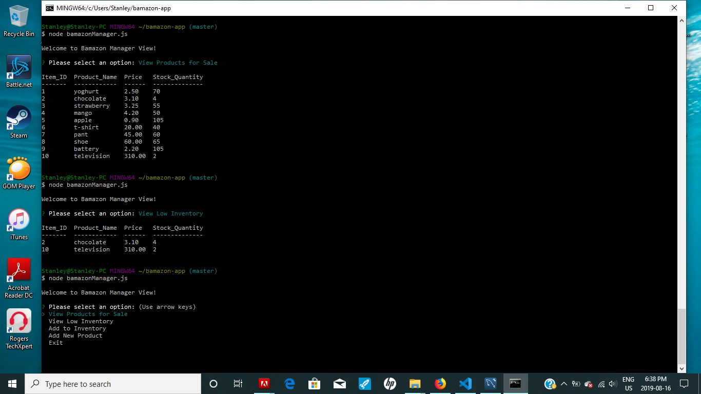
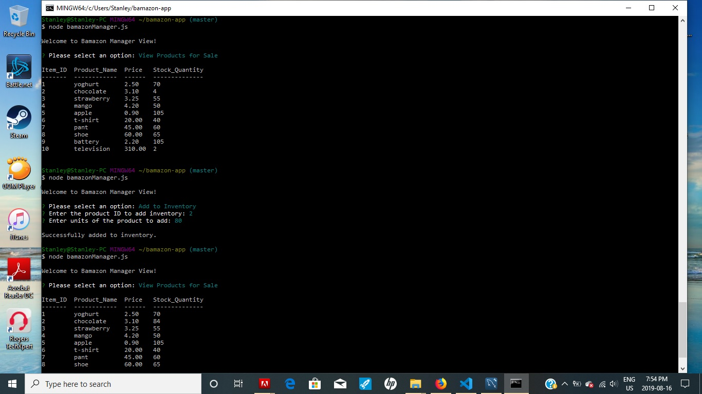
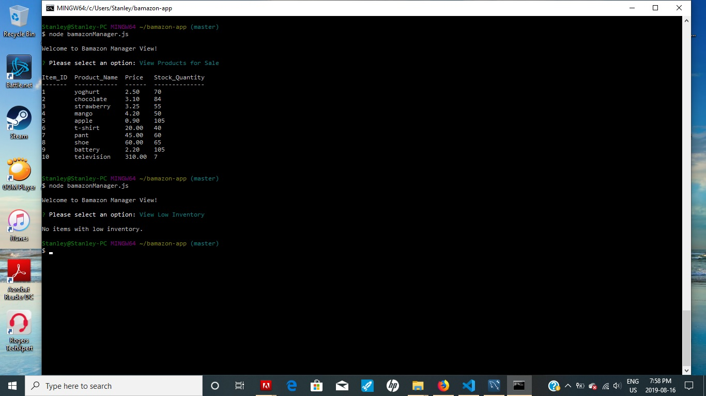
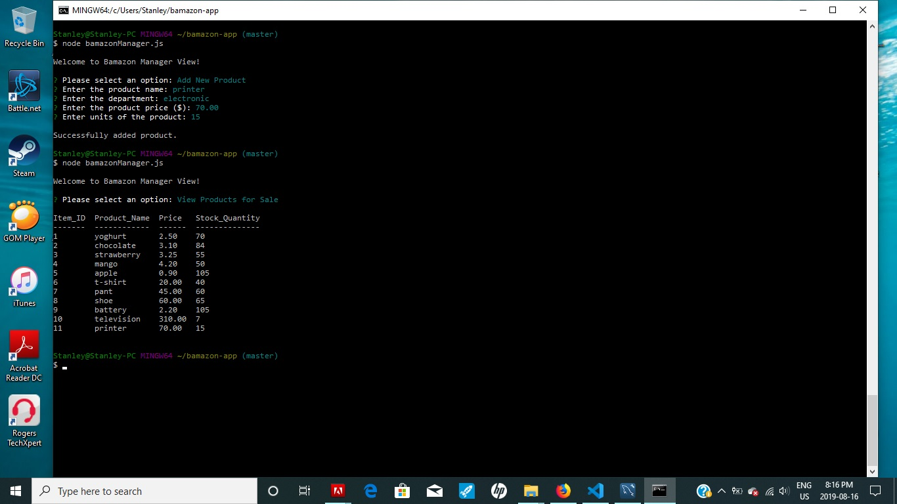
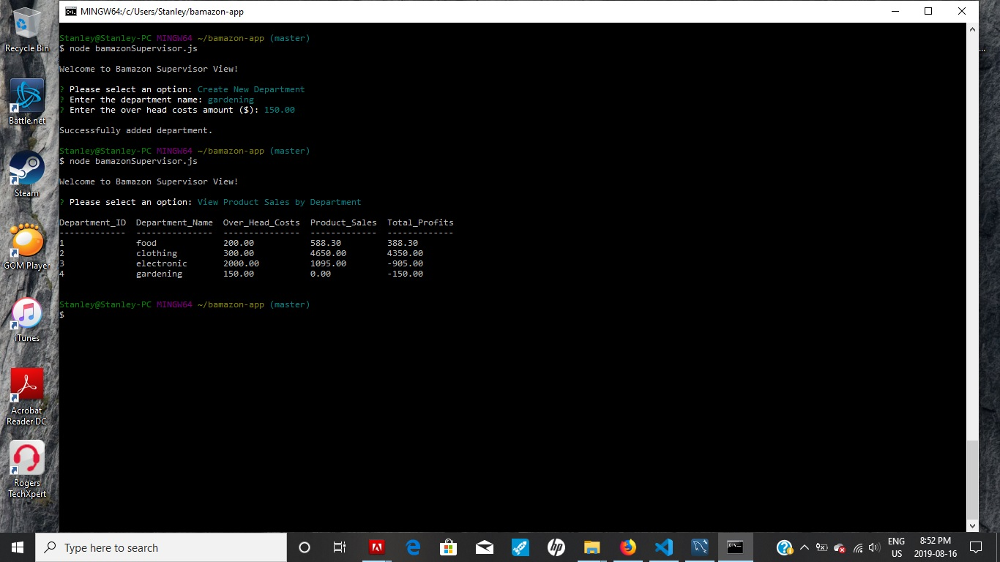

# Bamazon-App

## Description

Bamazon is a command line node application that runs as an Amazon-like storefront. There are three levels of accessibility: customer, manager, and supervisor. Customers are able to view and purchase items on sale, managers are able to view and update/add items to the store, and supervisors are able to view summaries of sales by department and add departments to the store.

### Important Node Packages Used

* [MySQL](https://www.npmjs.com/package/mysql)
* [Inquirer](https://www.npmjs.com/package/inquirer)
* [Console.table](https://www.npmjs.com/package/console.table)
* [DotEnv](https://www.npmjs.com/package/dotenv)

## Bamazon Views

1. `node bamazonCustomer.js`

Customers are able to view and purchase items on sale. If there is insufficient stock for the item, the order will not proceed.



2. `node bamazonManager.js`

Managers are able to view and update/add items to the store. Running this application will offer four options:

```
    * View Products for Sale
    * View Low Inventory
    * Add to Inventory
    * Add New Product
```

The "View Low Inventory" option will display all items with an inventory count lower than five.






3. `node bamazonSupervisor.js`

Supervisors are able to view summaries of sales by department and add departments to the store. Running this application will offer two options:

```
    * View Product Sales by Department
    * Create New Department
```




## Contributor

Stanley Zhu - Developer


